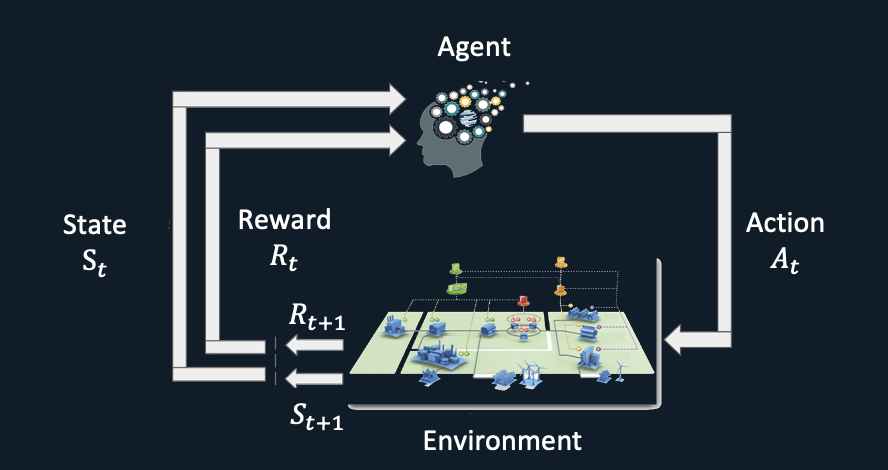
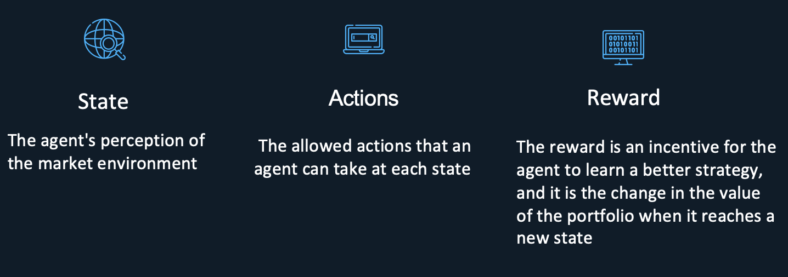
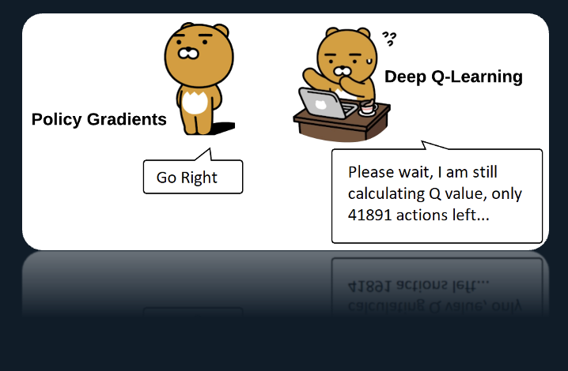

# FAD2: Financial AI Agent, DDPG-based Deep Reinforcement Learning Stock Trading Agent

## Project Overview
This project focuses on applying AI techniques to enhance quantitative trading (QT) in finance, specifically through Deep Reinforcement Learning (DRL).

### Objectives
- Automate market condition recognition and optimal trading strategy execution.
- Apply DRL algorithms, like Deep Deterministic Policy Gradient (DDPG), for prediction and trading.
  

### Methodology
- Integrated DDPG into the FinRL architecture.
- Conducted model training using DOW30 stock data on Colab.
  

### Challenges and Future Work
- Identified areas for performance improvement and stability.
- Plan to explore Quantum Lever Prices (QPLs) and enhance data preprocessing.

This project aims to advance AI-driven trading strategies for better profit maximization and risk minimization.
